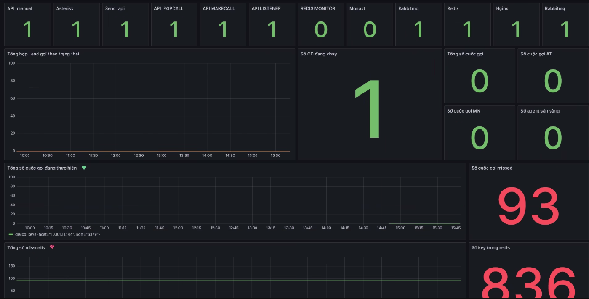

# OPS_Kamailio Monitoring System

A monitoring system for OPS_Kamailio using InfluxDB and Grafana to collect, store, and visualize metrics.

## System Architecture



The system consists of the following main components:

1. **Metric Collectors**:
   - `sip_metric.py`: Collects metrics about SIP response time
   - `podman_metric.py`: Monitors container statuses
   - `http_code_metric.py`: Collects HTTP response codes
   - `asterisk_metric.py`: Collects metrics from Asterisk PBX

2. **Storage & Visualization**:
   - InfluxDB: Stores time-series data
   - Grafana: Displays dashboards and alerts

## Types of Metrics

### 1. SIP Metrics
- Response time (RTT) of SIP connections
- Analysis by trunk and protocol (TCP/UDP)
- Configuration in `sip_metric.yaml`

### 2. Container Metrics
- Status of containers (Kamailio, MySQL, etc.)
- Uptime and health checks
- Configuration in `podman_metric.yaml`

### 3. HTTP Response Metrics
- HTTP response code statistics
- Error rates and API performance
- Configuration in `http_code_metric.yaml`

### 4. Asterisk Metrics
- Number of active calls
- Agent status
- Campaign statistics
- Configuration in `asterisk_metric.yaml`

## Installation

1. Install dependencies:
```bash
pip install -r requirements.txt
```

2. Configure YAML files according to your environment:
   - Fill in InfluxDB information (URL, token, org, bucket)
   - Configure endpoints to monitor
   - Adjust metric collection parameters

3. Run the metric collectors:
```bash
python sip_metric.py
python podman_metric.py
python http_code_metric.py
python asterisk_metric.py
```

## Grafana Dashboards

Sample dashboards provided:

1. System Overview:
   - Container status
   - Active calls
   - Available agents
   - Running campaigns

2. SIP Monitoring:
   - RTT by trunk
   - Protocol performance
   - Connection status

3. API Performance:
   - Response codes distribution
   - Error rates
   - Response times

4. Call Analytics:
   - Call volume
   - Success rates
   - Agent performance

## Troubleshooting

1. **Cannot connect to InfluxDB**:
   - Check URL and token in configuration file
   - Verify InfluxDB is running and accessible

2. **No SIP metrics visible**:
   - Check port 5061
   - Verify SIP trunk configuration

3. **Container metrics not showing**:
   - Check Podman socket
   - Verify access permissions

4. **Metrics not appearing in InfluxDB**:
   - Check collector logs
   - Verify bucket and org configuration

## Contributing

Please submit pull requests for any improvements. For major changes, please open an issue first to discuss what you would like to change.

## License

[MIT License](LICENSE)
